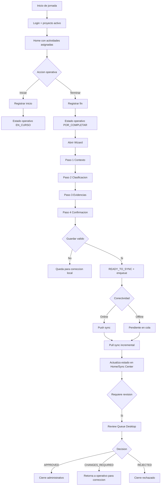

# Flujo Operativo SAO (AS-IS)

## Objetivo
Documentar el flujo actual implementado y validado del sistema SAO para operación de campo y coordinación.

Documento alineado con:

- `STATUS.md`
- `docs/WORKFLOW.md`
- `docs/SYNC.md`

---

## Resumen ejecutivo

1. El flujo operativo principal esta activo de punta a punta: asignacion, captura, sync, revision y decision.
2. La operacion funciona en modo offline-first con cola local y sincronizacion incremental.
3. La revision por coordinacion opera por cola y decisiones en backend (`APPROVE`, `REJECT`, `CHANGES_REQUIRED`, `APPROVE_EXCEPTION` segun rol).
4. El ciclo operativo->review->pull ya se ejecuto con evidencia en entorno real.
5. La principal mejora pendiente no es habilitacion funcional base, sino endurecimiento del contrato y UX orientada a tareas.

---

## Diagrama funcional AS-IS

---

## Flujo por etapa (AS-IS)

## 1) Asignacion y agenda

1. El usuario inicia sesion y selecciona proyecto activo.
2. Home y agenda muestran actividades asignadas desde backend.
3. La visibilidad depende de reglas de asignacion y sync_version del dominio.

## 2) Ejecucion operativa

1. Iniciar actividad cambia estado operativo a `EN_CURSO`.
2. Terminar actividad la mueve a `POR_COMPLETAR`.
3. El wizard consolida datos, clasificacion y evidencias.

## 3) Guardado y cola local

1. Al guardar valido, la actividad queda lista para sincronizar.
2. Se inserta item en cola local de sync.
3. Si no hay red, el item permanece pendiente sin perder captura.

## 4) Sincronizacion

1. Push envia pendientes por lote.
2. Pull incremental recupera actualizaciones de servidor.
3. Sync Center expone estado de pendientes, errores y reintentos.

## 5) Revision de coordinacion

1. Actividades en revision aparecen en cola desktop.
2. Coordinacion decide aprobar, pedir cambios o rechazar.
3. El resultado vuelve al operativo via pull sync.

---

## Vista actual por dimensiones de estado

La operacion ya usa en la practica tres dimensiones, aunque la UX aun tiene margen para simplificarse:

1. Estado operativo: pendiente, en curso, por completar, bloqueada/cancelada.
2. Estado de sync: local, listo para sync, sincronizado o error.
3. Estado de revision: no aplica, pendiente, requiere cambios, aprobado, rechazado.

---

## Riesgos actuales del AS-IS

1. Parte de la experiencia aun expone estados tecnicos al usuario final.
2. La devolucion de revision todavia puede llegar con semantica poco accionable.
3. La visibilidad de actividades sigue sensible a reglas de asignacion/sync si no se mantiene contrato unico entre capas.
4. El sistema esta funcionalmente cerrado, pero requiere endurecimiento de flujo para reducir soporte reactivo.

---

## Enlace al siguiente paso

El roadmap de mejora sobre este AS-IS se encuentra en:

- `docs/PLAN_MEJORA_FLUJO_2026-03-24.md`
- `docs/BACKLOG_MEJORA_FLUJO_2026-03-24.md`
