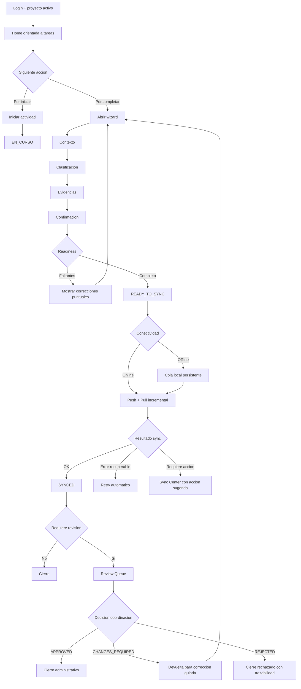

# Flujo Operativo SAO (TO-BE)

## Objetivo
Definir el siguiente nivel de madurez del flujo, pasando de un sistema funcionalmente cerrado a un sistema con experiencia orientada a tareas, contrato unificado y menor friccion operativa.

Documento alineado con:

- `docs/WORKFLOW.md`
- `docs/SYNC.md`
- `docs/PLAN_MEJORA_FLUJO_2026-03-24.md`

---

## Principios TO-BE

1. Flujo unico: asignacion, ejecucion, captura, sync y revision se entienden como una sola historia.
2. UX orientada a tareas: el usuario ve que hacer, no estados internos.
3. Guardado incremental: ningun avance del wizard se pierde.
4. Errores accionables: todo fallo de sync/revision explica causa y accion.
5. Observabilidad operativa: dashboard y reportes miden friccion de proceso.

---

## Diagrama TO-BE (flujo objetivo)

---

## Vista objetivo por dimensiones de estado

## 1) Operativo

- `PENDIENTE`
- `EN_CURSO`
- `POR_COMPLETAR`
- `BLOQUEADA`
- `CANCELADA`

## 2) Sync

- `LOCAL_ONLY`
- `READY_TO_SYNC`
- `SYNC_IN_PROGRESS`
- `SYNCED`
- `SYNC_ERROR`

## 3) Revision

- `NOT_APPLICABLE`
- `PENDING_REVIEW`
- `CHANGES_REQUIRED`
- `APPROVED`
- `REJECTED`

Regla TO-BE: cada vista debe renderizar la siguiente accion a partir de esta proyeccion canonica, sin heuristicas locales.

---

## Experiencia objetivo por rol

## Operativo

1. Home en bandejas de trabajo: por iniciar, en curso, por completar, por corregir, con error de envio.
2. Wizard recuperable en cualquier paso.
3. Readiness previo al submit con faltantes claros.
4. Sync Center con causa de error y accion sugerida.

## Coordinacion (desktop)

1. Cola de revision basada en datos estructurados.
2. ValidationPage prioriza checklist, GPS, evidencias y observaciones.
3. Devolucion estructurada por categoria, severidad, campo/evidencia afectada y accion requerida.

---

## Reglas funcionales TO-BE

1. Una actividad no desaparece: solo cambia de bandeja segun siguiente accion.
2. Captura parcial permitida, submit final con validacion consistente cliente-backend.
3. Sync expone errores tipificados (`code`, `retryable`, `suggested_action`).
4. Asignaciones y reasignaciones incrementan version y mantienen responsable efectivo persistido.
5. Cierre administrativo solo despues de resultado de revision cuando aplique.

---

## KPIs objetivo

1. tiempo asignacion -> inicio
2. tiempo fin -> captura completa
3. tiempo captura -> sync exitosa
4. tiempo en revision
5. tasa de cambios requeridos por tipo
6. tasa de error de sync por categoria

---

## Gap principal AS-IS vs TO-BE

1. Pasar de estados tecnicos visibles a bandejas por tarea.
2. Pasar de devolucion de revision reactiva a correccion guiada y estructurada.
3. Pasar de sync centrado en mecanica a sync centrado en accion operativa.
4. Pasar de monitoreo por volumen a KPIs de friccion de proceso.

---

## Implementacion

El detalle de ejecucion de este TO-BE se encuentra en:

- `docs/PLAN_MEJORA_FLUJO_2026-03-24.md`
- `docs/BACKLOG_MEJORA_FLUJO_2026-03-24.md`

